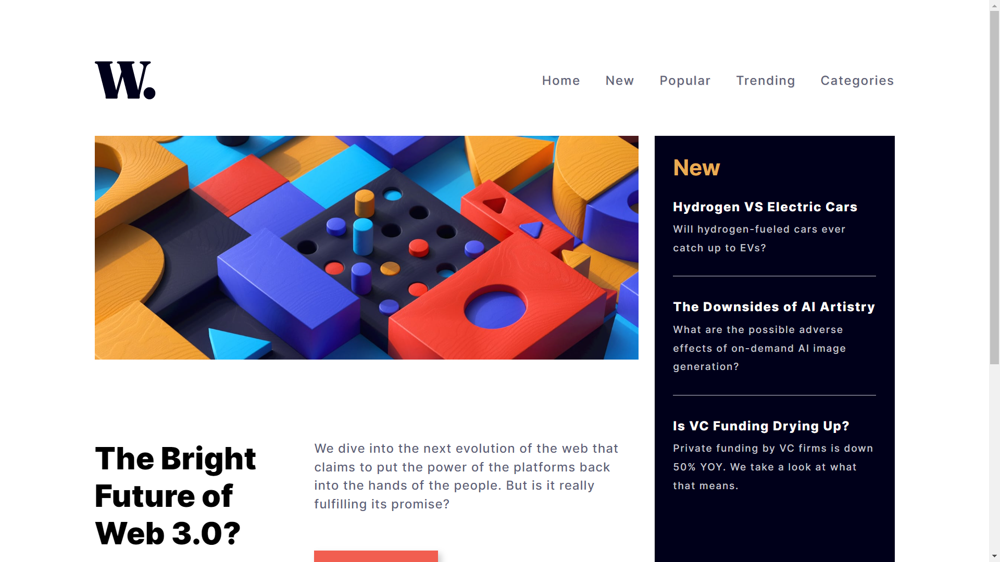

# Frontend Mentor - News homepage solution

This is a solution to the [News homepage challenge on Frontend Mentor](https://www.frontendmentor.io/challenges/news-homepage-H6SWTa1MFl). Frontend Mentor challenges help you improve your coding skills by building realistic projects.

## Table of contents

- [Overview](#overview)
  - [The challenge](#the-challenge)
  - [Screenshot](#screenshot)
  - [Links](#links)
- [My process](#my-process)
  - [Built with](#built-with)
  - [Useful resources](#useful-resources)
- [Author](#author)
- [Acknowledgments](#acknowledgments)

## Overview

### The challenge

Users should be able to:

- View the optimal layout for the interface depending on their device's screen size
- See hover and focus states for all interactive elements on the page

### Screenshot

.png>)
.png>)

### Links

- Solution URL: [Add solution URL here](https://your-solution-url.com)
- Live Site URL: [Add live site URL here](https://your-live-site-url.com)

## My process

### Built with

- Semantic HTML5 markup
- CSS custom properties
- Flexbox
- CSS Grid
- Desktop-first workflow

### Useful resources

- [CDNJS](https://www.cdnjs.com) - cdnjs is a free and open-source CDN service which make it faster and easier to load library files on your websites.

- [FONT AWESOME](https://www.fontawesome.com) - Font Awesome is the Internet's icon library and toolkit, used by millions of designers, developers, and content creators.

## Author

- Frontend Mentor - [@riki8055](https://www.frontendmentor.io/profile/riki8055)
- GitHub - [@riki8055](https://github.com/riki8055)

## Acknowledgments

Thanks [FrontEnd Mentor](https://www.frontendmentor.io) for this challenge.
